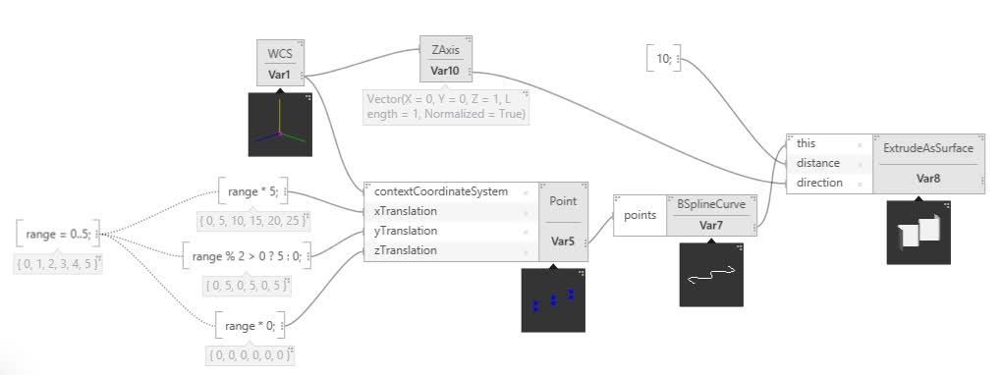
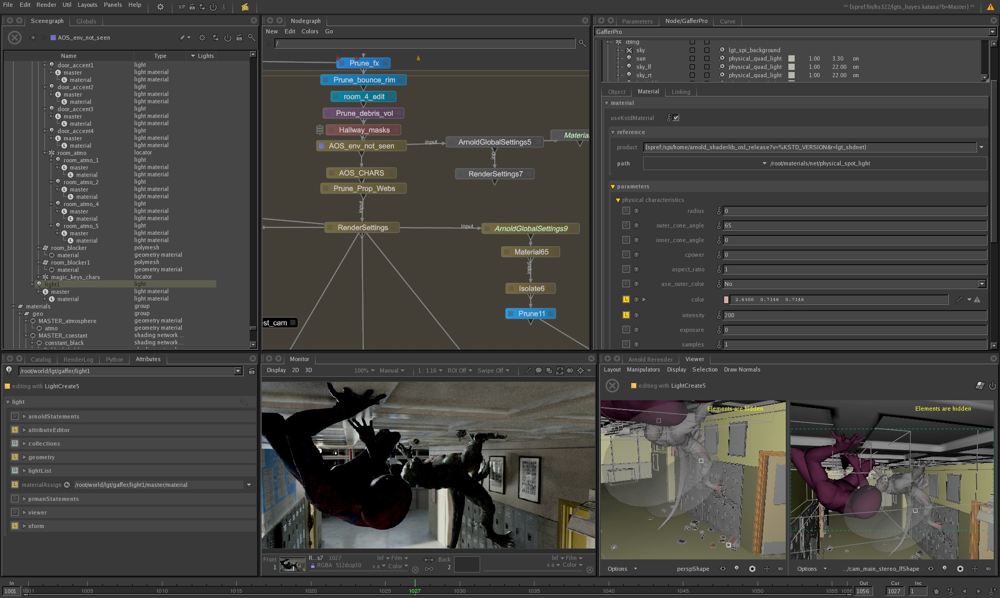
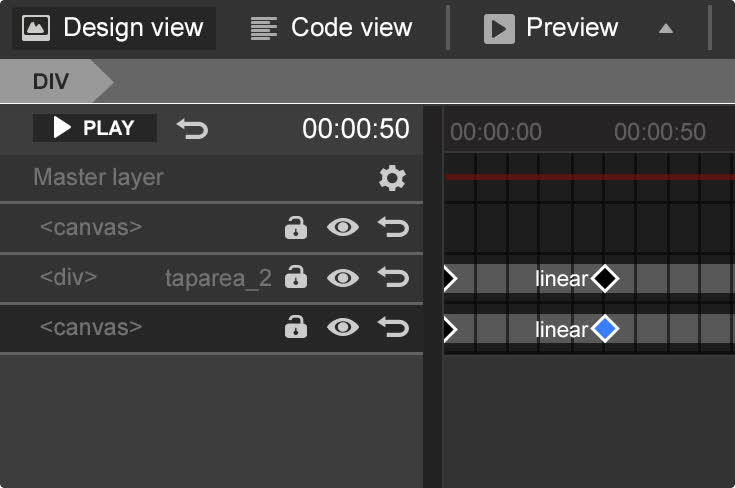
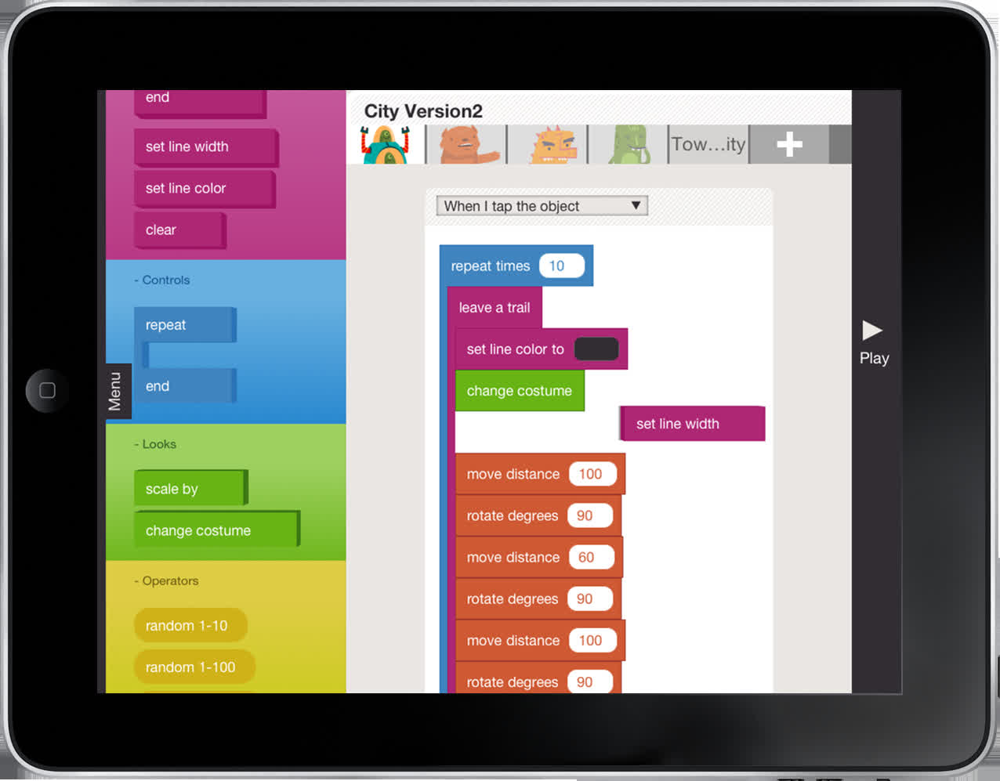
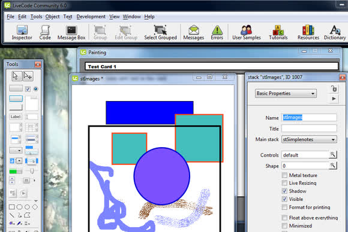
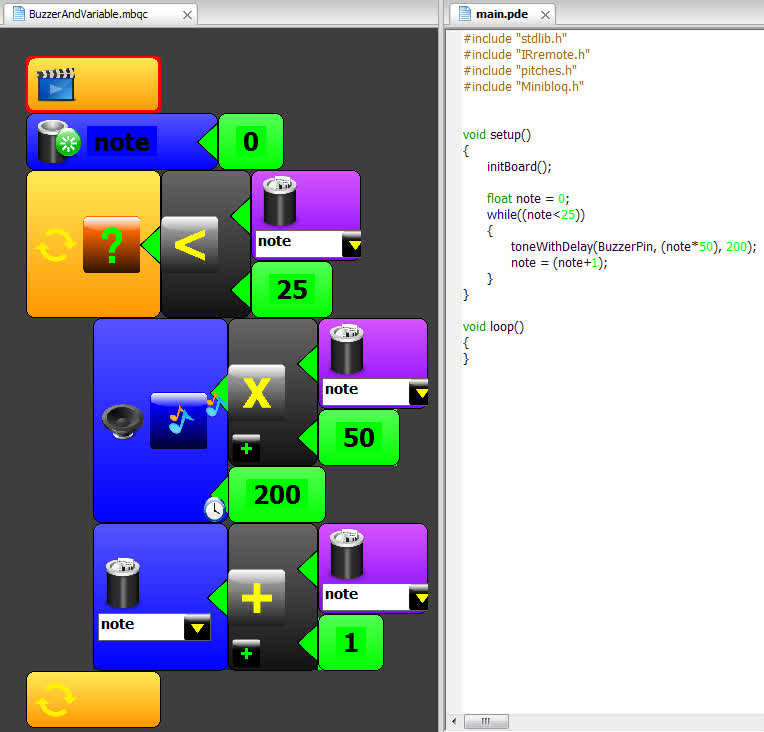
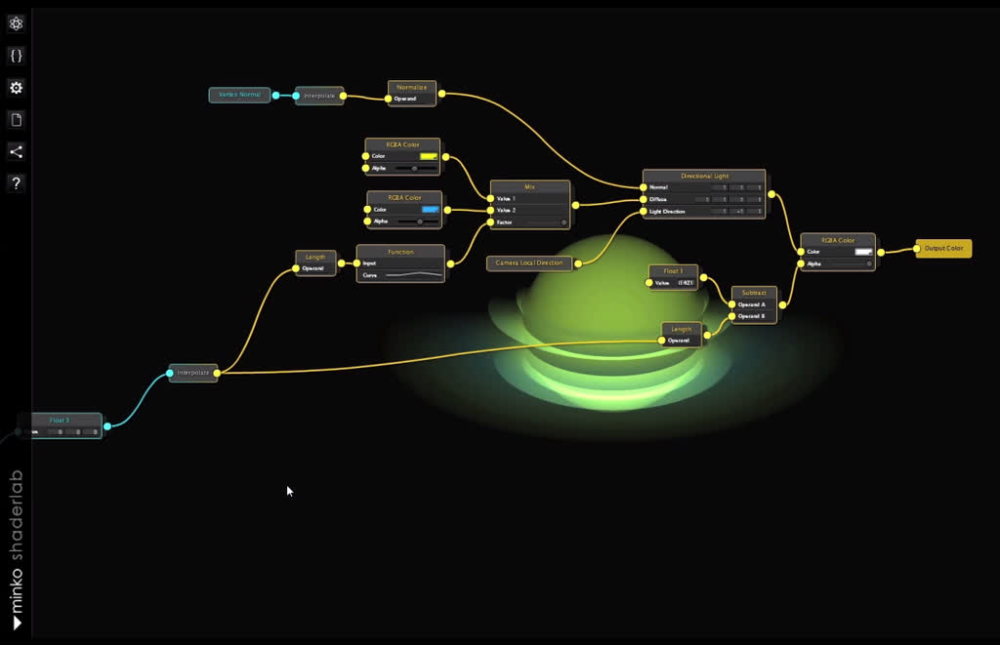

# Visual Programming Environments

Organized and converted to Markdown from [Wikipedia: Visual Programming Language](http://en.wikipedia.org/wiki/Visual_programming_language) and [Visual Programming Language Snapshots](http://blog.interfacevision.com/design/design-visual-progarmming-languages-snapshots/).

### Aardappel

[Web Site](http://strlen.com/aardappel-language)

### ADL

  
[Web Site](https://www.tradingtechnologies.com/products/trading-analytics/xtrader/adl/)

### AgentSheets and AgentCubes

[Wikipedia](http://en.wikipedia.org/wiki/Agentsheets), [Web Site](http://www.agentsheets.com/)

### Agilent VEE

[Web Site](http://www.home.agilent.com/agilent/editorial.jspx?cc=SG&lc=eng&ckey=2258391&nid=-11143.0.00&id=2258391)

### Alice

[Wikipedia](http://en.wikipedia.org/wiki/Alice_%28software%29) - [Web Site](http://en.wikipedia.org/wiki/File:Alice-2-screenshot.jpg)

### Amici

[Web Site](http://dimeb.informatik.uni-bremen.de/eduwear/about/)

### Appacitive

[Web Site](http://appacitive.com/)

### Apple Shake

[Web Site](http://www.apple.com/support/shake/)

### AppWare

[Wikipedia](http://en.wikipedia.org/wiki/AppWare) - [Web Site](http://appacitive.com/)

### App Inventor For Android

[Wikipedia](http://en.wikipedia.org/wiki/App_Inventor_for_Android) - [Web Site](http://appinventor.mit.edu/explore/)

### Analog Box

[Web Site](https://code.google.com/p/analog-box/)

### Andescotia

[Commercial Use](http://blog.interfacevision.com/design/design-visual-progarmming-languages-snapshots/#andescotia) via [Andescotia](http://www.andescotia.com/)

### ArcGIS Model Builder

[Web Site](http://resources.arcgis.com/en/help/main/10.1/index.html#//002w00000001000000)

### Audulus

[Web Site](http://www.musicappblog.com/audulus-review/)

### Automagic

[Web Site](http://automagic4android.com/)

### Automator

[Wikipedia](http://en.wikipedia.org/wiki/Automator_%28software%29) - [Web Site](http://www.apple.com/osx/apps/#automator)

### Babuino

[Web Site](http://home.teleport.com/~brettn/babuinobot_about/index.html) 

### Blender: Sverchok add on

[Web Site](http://www.blendernation.com/2013/11/01/sverchok-add-on-new-version-and-hangout-today/)

### Blender: Textures Nodes

[Web Site](http://wiki.blender.org/index.php/Doc:2.4/Manual/Textures/Types/Nodes) 

### Blockly

[Web Site](https://code.google.com/p/blockly/)

### BloodHound

[Web Site](http://www.sharkindicators.com/bloodhound/bloodhound-features/bloodhound-professional-features/) 

### Bounce

[Web Site](http://www.art.net/~hopkins/Don/lang/bounce/bounce.html)

### Cognitoy’s Mindrover

[Web Site](http://www.mindrover.com/mindrover.html)

### ChipWits

[Web Site](http://chipwits.com/index.html) 

### Copper Thoughts

[Web Site](http://www.copperthoughts.com/)

### Coral

[Web Site](http://www.blurrypaths.com/post/29898257065/coral-open-source-visual-programming-environment)

### Cortex

[Web Site](http://www.edventures.com/products/by-product/the-brain/cortex-programming-software.html) 

### CyberToolbox

[Web Site](http://www.cybergarage.org/twiki/bin/view/Main/CyberToolboxForWin32) 

### Designscript

[Web Site](https://beta.autodesk.com/callout/?callid=E32D5D18F0C545469AF146D49BE0B31C)

### DRAKON

[Wikipedia](http://en.wikipedia.org/wiki/DRAKON) - [Web Site](http://drakon-editor.sourceforge.net/)

### DrawFBP

[Wikipedia](http://en.wikipedia.org/wiki/Flow-based_programming#Software_on_FBP_web_site) - [Web Site](http://www.jpaulmorrison.com/graphicsstuff/)

[Flow-based programming](http://en.wikipedia.org/wiki/Flow-based_programming) implemented visually by the creator of flow-based programming: [John Paul Morrison](http://en.wikipedia.org/wiki/John_Paul_Morrison).

### Dream Maker

[Web Site](http://www.byond.com/docs/guide/)

### Drupal

[Web Site](https://drupal.org/project/vvd) 

### Dynamo

[Web Site](http://autodeskvasari.com/dynamo) 

### Engi JS

[Live! Use It Now](http://www.engijs.org/) - [Web Site](https://github.com/engijs/engi)

### Etoys / Squeak

[Wikipedia](http://en.wikipedia.org/wiki/Etoys_%28programming_language%29) - [Web Site](http://www.squeakland.org/)

### Eyeon Fusion

[Web Site](http://www.eyeonline.com/Fusion.html)

### EyesWeb

[Web Site](http://www.audiovisualizers.com/toolshak/vjprgpix/eyesweb/eyesweb.htm)

### Field

[Web Site](http://openendedgroup.com/field/)

### FL Studio

[Wikipedia](http://en.wikipedia.org/wiki/Fl_studio) - [Web Site](http://www.image-line.com/flstudio/)

### FlowLab

[Web Site](http://flowlab.io/)

### Foundry Modo

[Web Site](http://www.thefoundry.co.uk/products/modo/)

### FlexMonkey

[Try It Out Here](http://flexmonkey.co.uk/redilab-node-006/ReDiLabNode.html), [Calculator](http://www.flexmonkey.co.uk/calc_v1/NodeRenderer.html), [Web Site](http://flexmonkey.co.uk/)

### Flow Hub and NoFlo

[Web Site 1](http://noflojs.org/) - [Web Site 2](http://flowhub.io/)

### FlowStone

[Web Site](http://www.dsprobotics.com/flowstone.html)

### GenerativeComponents

[Web Site](http://www.bentley.com/en-US/Promo/Generative+Components/default.htm)

### GoDot Engine

[Web Site](http://www.godotengine.org/wp/)

### Google Web Designer

[Wikipedia](http://en.wikipedia.org/wiki/Google_Web_Designer) - [Web Site](https://www.google.com/webdesigner/)

### GRaIL (Graphical Input Language)

[PDF](http://www.rand.org/content/dam/rand/pubs/research_memoranda/2005/RM5999.pdf)

### Grasshopper 3D

[Wikipedia](http://en.wikipedia.org/wiki/Grasshopper_3d) - [Web Site](http://www.grasshopper3d.com/)

### Hopscotch

[Wikipedia](http://en.wikipedia.org/wiki/Hopscotch_%28programming_language%29) - [Web Site](https://www.gethopscotch.com/)

### Houdini (Node Based Workflow)

[Web Site](https://www.sidefx.com/)

### HyperCard

[Wikipedia](http://en.wikipedia.org/wiki/HyperCard) - [Unofficial Web Site](http://hypercard.org/)

### Hypergraph

[Web Site](http://download.autodesk.com/global/docs/maya2014/en_us/index.html?url=files/Basics_Windows_and_Editors_Hypergraph_overview.htm,topicNumber=d30e87351)

### ICE (Interactive Creative Environment)

[Wikipedia](http://en.wikipedia.org/wiki/Autodesk_Softimage#ICE_Interactive_Creative_Environment) - [Web Site](http://www.autodesk.com/products/autodesk-softimage/features/ice-and-dynamic-simulation/gallery-view)

### IFTTT

[Wikipedia](http://en.wikipedia.org/wiki/Ifttt) - [Web Site](https://ifttt.com/wtf)

### iLab Neuromorphic Robotics Toolkit

[Web Site](http://robosavvy.com/forum/viewtopic.php?f=1&t=8481&sid=7e4e5d536cb7d12bd3e2d51718f0300b) 

### Illumination Software Creator

[Wikipedia](http://en.wikipedia.org/wiki/Illumination_Software_Creator) - [Web Site](http://lunduke.com/2010/06/16/illumination-software-creator-20-beta-2/)

### InfoSphere Streams

[Web Site](http://www-03.ibm.com/software/products/en/infosphere-streams/)

### Intentional Technology

[Web Site](http://www.intentsoft.com/intentional-technology/)

### Isadora

[Web Site](http://remotepresence.org/?p=534)

### Java Studio 1.0

[Web Site ???](http://www.oracle.com/us/sun/index.html)

### Jeskola Buzz

[Wikipedia](http://en.wikipedia.org/wiki/Jeskola_Buzz) - [Web Site](http://www.jeskola.net/buzz/)

### Kimono

[Web Site](http://www.kimonolabs.com/)

### Klieg

[Web Site](http://www.tkl.iis.u-tokyo.ac.jp/~toyoda/index_e.html)

### Knime

[Web Site](http://www.knime.org/)

### Kodu (Boku)

[Wikipedia](http://en.wikipedia.org/wiki/Kodu), [Web Site](http://research.microsoft.com/en-us/projects/kodu/)

### Kyma

[Web Site](http://www.symbolicsound.com/cgi-bin/bin/view/Products/WebHome) 

### LabView

[Wikipedia](http://en.wikipedia.org/wiki/LabVIEW) - [Web Site](http://www.ni.com/)

### Ladder Logic

[Wikipedia](http://en.wikipedia.org/wiki/Ladder_logic) - Web Site

### Lamdu

[Web Site](http://peaker.github.io/lamdu/)

### Lava

[Wikipedia](http://en.wikipedia.org/wiki/Lava_%28programming_language%29) - [Web Site](http://lavape.sourceforge.net/)

### Learnable Programming

[Web Site](http://worrydream.com/#!/LearnableProgramming)

### Lily

[Wikipedia](http://en.wikipedia.org/wiki/Lily_%28software%29) - [Web Site](http://blog.lilyapp.org/lily/demo/)

### Limnor Studio

[Wikipedia](http://en.wikipedia.org/wiki/Limnor) - [Web Site](http://www.limnor.com/studio_whatIsIt.html)

### Little Big Planet

[Wikipedia](http://en.wikipedia.org/wiki/LittleBigPlanet) - [Web Site](http://littlebigplanet.playstation.com/)

### LiveCode

Image Source, [Wikipedia](http://en.wikipedia.org/wiki/LiveCode) - [Web Site](http://runrev.com/)

### Mamba FX

[Web Site](http://www.mambatutorials.com/)

### MAX/MSP Jitter

[Web Site](http://cycling74.com/products/max/)

### Marten

Marten is an implementation of the [Prograph](http://en.wikipedia.org/wiki/Prograph) language.

[Web Site](http://www.andescotia.com/)

### MetaEdit+ Modeler

[Web Site](http://www.metacase.com/mep/) 

### MiceOnABeam

[Web Site](http://www.miceonabeam.com/)

### Mind+

[Web Site](http://www.mindplus.cc/)

### Microsoft Visual Programming Language MVPL

[Web Site](http://msdn.microsoft.com/en-us/library/bb483088.aspx)

### MindSpider

[Web Site](http://www.mistal-research.com/mindSpider.php)

### Minecraft

[Wikipedia](http://en.wikipedia.org/wiki/Minecraft) - [Web Site](https://minecraft.net/)

### Minibloq

[Wikipedia](http://en.wikipedia.org/wiki/Minibloq) - [Web Site](http://blog.minibloq.org/)

This has a really cool looking interface.

### Minko ShaderLab

[Web Site](http://blog.aerys.in/2012/02/06/new-minko-shaderlab-preview/)

### Modkit Arduino Visual Programming

[Web Site](http://www.modkit.com/) 

### Morphic

[Wikipedia](http://en.wikipedia.org/wiki/Morphic_%28software%29) - [Web Site](http://www.dmoz.org/Computers/Software/Operating_Systems/Graphic_Subsystems/Morphic)

### Mozilla Appmaker

[Web Site](https://appmaker.mozillalabs.com/). Discussion on [Ycombinator](https://news.ycombinator.com/item?id=6501731).

### MST Workshop

[Wikipedia](http://en.wikipedia.org/wiki/MST_Workshop), [Web Site](http://home.comcast.net/~tpandolfi/site/?/home/)

### NeatTools Visual Programming Environment

[Web Site](http://www.neattools.org/)

### Nevo Studio

[Web Site](http://www2.worthingtondistribution.com/blog/?p=66)

### NodeBox

[Web Site](http://nodebox.net/)

### Nuke

[Wikipedia](http://en.wikipedia.org/wiki/Nuke_%28software%29) - [Web Site](http://www.thefoundry.co.uk/products/nuke-product-family/nuke/)

### Num3sis Composer

[Web Site](http://num3sis.inria.fr/blog/category/composer/)

### NXT-G

[Wikipedia](http://en.wikipedia.org/wiki/Lego_Mindstorms_NXT#NXT-G) - [Web Site](http://www.legoengineering.com/program/nxt-g/)

### OpenAlea Visualea

[Web Site](http://openalea.gforge.inria.fr/doc/openalea/doc/_build/html/index.html)

### OpenDX

[Web Site](http://www.opendx.org/)

### OpenFlippers

[Web Site](http://www.openflipper.org/index.php?id=240)

### Open Modelica

[Web Site](https://www.openmodelica.org/)

### Open Music

[Wikipedia](http://en.wikipedia.org/wiki/OpenMusic) - [Web Site](http://repmus.ircam.fr/openmusic/home)

### OpenWire

[Wikipedia](http://en.wikipedia.org/wiki/OpenWire_%28library%29), [Web Site](http://www.mitov.com/products/openwire#overview)

### Orange

[Web Site](http://orange.biolab.si/) 

### Origami

[Web Site](http://facebook.github.io/origami/)

### Piet

[Wikipedia](http://en.wikipedia.org/wiki/Piet_%28programming_language%29#Piet) - [Web Site](http://www.retas.de/thomas/computer/programs/useless/piet/Piet/index.html)

### Pipes

[Wikipedia](http://en.wikipedia.org/wiki/Yahoo!_Pipes) - [Web Site](http://pipes.yahoo.com/pipes/)

### Pypes

[Web Site](http://www.pypes.org/)

### Praxis LIVE

[Web Site](http://www.praxislive.org/)

### Programming Without Coding Technology

[Web Site](http://doublesvsoop.sourceforge.net/)

### Prograph

[Wikipedia](http://en.wikipedia.org/wiki/Prograph) - [Web Site??](http://c2.com/cgi/wiki?PrographLanguage)

### PSeint

[Web Site](http://pseint.sourceforge.net/)

### Pure Data

[Wikipedia](http://en.wikipedia.org/wiki/Pure_Data) - [Web Site](http://puredata.info/)

### Pygmalion

[Web Site Info Only](http://acypher.com/wwid/Chapters/01Pygmalion.html)

### Quadrigram

[Web Site](http://www.quadrigram.com/)

### Quartz Composer

[Wikipedia](http://en.wikipedia.org/wiki/Quartz_Composer), [Web Site](https://developer.apple.com/technologies/mac/graphics-and-animation.html)

### RapidMiner

[Web Site](http://rapidminer.com/) 

### Reactable

[Web Site](http://www.reactable.com/products/mobile/) 

### Reaktor

[Wikipedia](http://en.wikipedia.org/wiki/Reaktor) - [Web Site](http://www.native-instruments.com/en/products/komplete/synths-samplers/reaktor-5/)

### Redwire

[Live! Use It Now](http://redwire.io/#/game/bc2564b4e6b27b88/edit) - [Web Site](http://redwire.io/)

### Scheme Bricks

[Web Site](http://www.pawfal.org/dave/index.cgi?Projects/Scheme%20Bricks)

### Scratch

[Wikipedia](http://en.wikipedia.org/wiki/Scratch_%28programming_language%29), [Web Site](http://scratch.mit.edu/)

### Sextante

[Web Site](http://sextantegis.com/)

### Simulink

[Wikipedia](http://en.wikipedia.org/wiki/Simulink) - [Web Site](http://www.mathworks.com/products/simulink/?s_cid=wiki_simulink_8)

### Sikuli

[Wikipedia](http://en.wikipedia.org/wiki/Sikuli) - [Web Site](http://www.sikuli.org/)

### SketchPad

[Wikipedia](http://en.wikipedia.org/wiki/Sketchpad) - [Web Site](http://www.youtube.com/watch?v=495nCzxM9PI&feature=player_embedded)

### Snap!

[Web Site](http://snap.berkeley.edu/)

### Sprog

[Web Site](http://sprog.sourceforge.net/index.html) 

### Substance Designer

[Web Site](http://store.steampowered.com/video/238710)

### Synopsis

[Web Site](http://www.codemorphis.com/) 

### SynthEdit

[Web Site](http://www.synthedit.com/)

### SQL Server Integration Services

[Wikipedia](http://en.wikipedia.org/wiki/SQL_Server_Integration_Services) - [Web Site](http://www.microsoft.com/en-us/sqlserver/solutions-technologies/enterprise-information-management/integration-services.aspx)

### Streamtools

[Web Site](https://source.opennews.org/en-US/articles/introducing-streamtools/)

### StroyCode

[Web Site](http://softconstructors.com/en/applications/stroycode/)

### Stylus Studio

[Web Site](http://www.stylusstudio.com/xml_brochure.html) 

### Tersus

[Web Site](http://www.tersus.com/) 

### TextIt

[Web Site](https://textit.in/)

### Thyrd

[Web Site](http://thyrd.org/)

### TouchDesigner

[Wikipedia](http://en.wikipedia.org/wiki/Houdini_%28software%29#TouchDesigner) - [Web Site](https://www.derivative.ca/)

### Touch Develop

[Web Site](https://www.touchdevelop.com/)

### Tydlig

[Web Site](http://tydligapp.com/)

### Thymio VPL

[Web Site](http://thymio.org/)

### Tynker

[Web Site](http://www.tynker.com/)

### UDK Kismet

[Web Site](http://www.worldofleveldesign.com/categories/wold-members-tutorials/petebottomley/udk-kismet-introduction.php)

### UDK

[Web Site](http://www.unrealengine.com/en/udk/)

### Unix Tools

[Web Site](http://www.dmst.aueb.gr/dds/pubs/jrnl/2001-SPANDE-VUFC/html/vufc.html) 

### V+

[Web Site](http://www.simphonics.com/products/software/vplus/)

### Video Processing Language for the Raspberry Pi

[Web Site](https://github.com/CalumJEadie/video-processing-language-for-the-raspberry-pi)

### Viscuit

[Web Site](http://www.viscuit.com/)

### VisTrails

[Web Site](http://twiki.ipaw.info/bin/view/Challenge/VisTrails)

### Visual Basic

[Web Site](https://en.wikipedia.org/wiki/Visual_Basic_(classic))

### Visual JForex

[Web Site](http://www.dukascopy.com/swiss/english/forex/Visual/features/)

### VRL-Studio

[Web Site](http://vrl-studio.mihosoft.eu/)

### VUO

[Web Site](http://vuo.org/)

### VVVV

[Wikipedia](http://en.wikipedia.org/wiki/Vvvv) - [Web Site](http://www.vvvv.org/)

### Windows Workflow Foundation

[Wikipedia](http://en.wikipedia.org/wiki/Windows_Workflow_Foundation) - [Web Site](http://msdn.microsoft.com/en-us/vstudio/jj684582.aspx)

### World machine

[Web Site](http://www.world-machine.com/)

### Xpresso

[Web Site](http://www.maxon.net/products/cinema-4d-prime/customizing.html)

### Zaluum

[Web Site](http://www.zaluum.com/)
